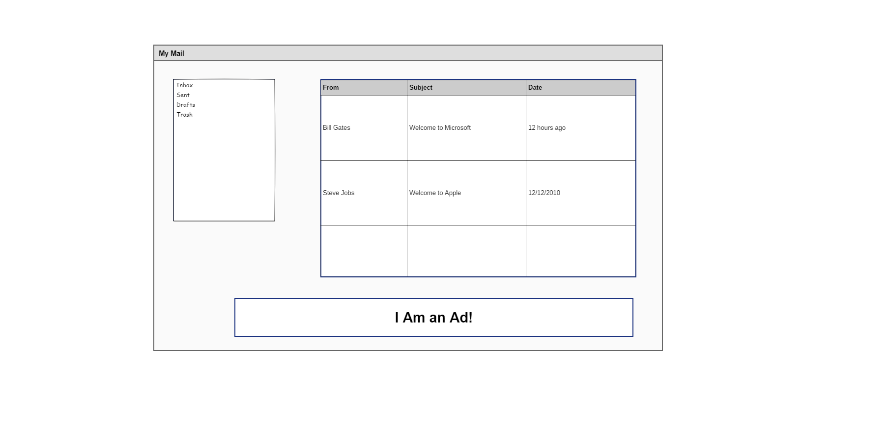

#### Create a webmail page:

1. Create a webmail page which has three sections:
    1. The left one is for navigation and contains links for Inbox, Sent, Drafts & Trash. You can use an un-ordered list to do that.
    2. The right box is a table of emails with coloumns for From, Subject & Date.
    3. The bottom one is for placing ads.
2. You can use sizes, colors, font, etc according to your choice.
3. Put your files inside a `WebMail` folder under `assignments`.
