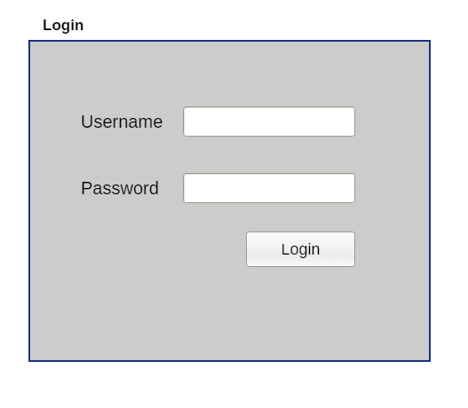

#### Create a login page that checks for username and password from the user -

1. The interface should look something like the above image.
2. All the inputs should be validated.
3. Username and password can be hardcoded into the javascript file.
