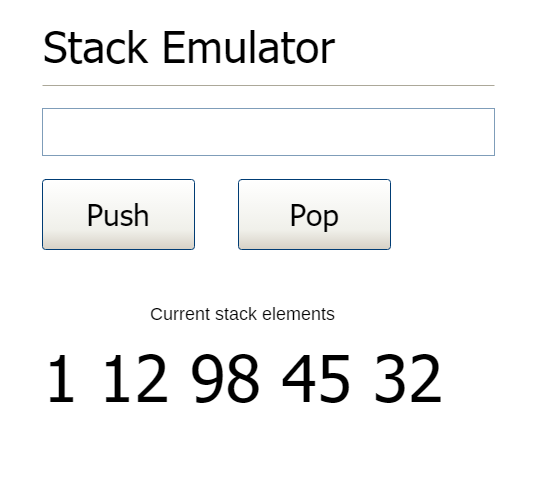

#### Create a Javascript app that emulates "Stack" behavior.

1. Push button should add value in the textbox to stack.
2. Pop button should remove the last element added to stack.
3. There should be validation for push button. Empty values should not be added to stack.
4. Array can be used as a stack along with push() and pop() methods.
5. During each operation, the stack display area should show the current stack contents.
