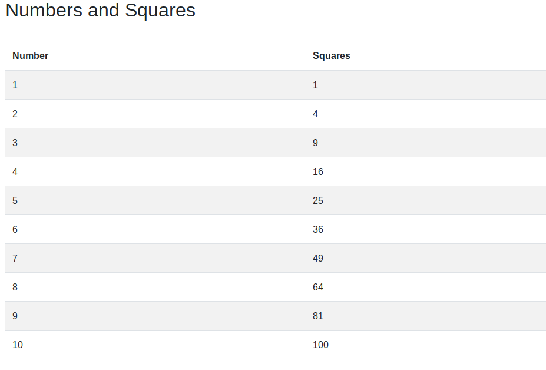

# DOM Manipulation

Create a Javascript program that produces a table of numbers from 1 to 10 and squares of them - 

USe DOM manipulation to create all the HTML elements. That is the HTML should only contain a `body` tag.
