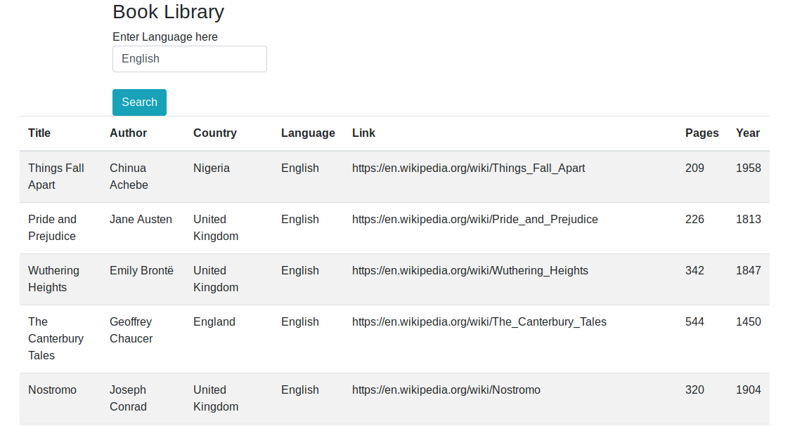

# Book Search App - Client Side

Create a Javascript application that lets the user search for books under a particular language - 

Use AJAX to load [books.json](books.json)

Use an event handler to get the user input from the form.

Create DOM manipulation methods to show the search result using a table.
