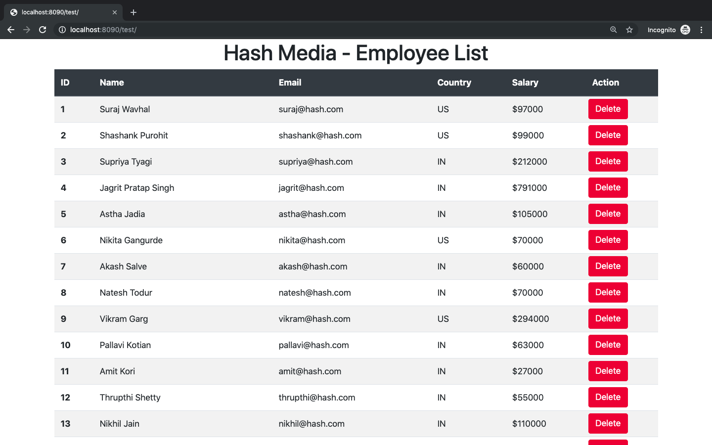

## Eagle Wildcard Entry Test

1. Create a node.js server with `express.js` framework with `handlebars` as view engine
2. On the homepage route `/`, load the view which appears in the above image
3. Create a `GET` route `/users` which will return the JSON content from this file [data.json](data.json) file. (place the content in a variable and just return it)
4.  Fetch data (App name, Header values, User list) from the `/users` route
5. App Name, Header values, User list should be rendered dynamically with jQuery
6. **Delete** button should be dynamically added in each row of the user with jQuery
7. On Click of **Delete** button, the row should be deleted

Note: 
1. To bind event listener to dynamically added element: Use: `$('body').on('click', '<elem-selector | class or ID>', function() ...`
2. Add `node_modules` directory to `.gitignore` file
3. Use Bootstrap to create layouts
